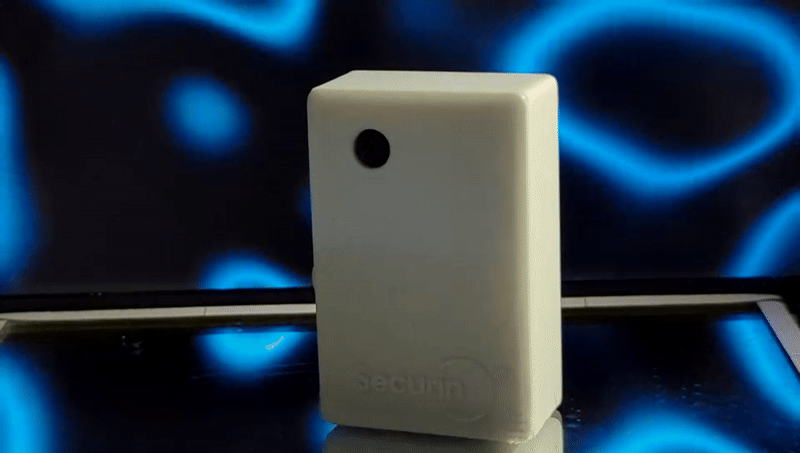

# Securin 

<div align="center">
<p align="center">
<a href="/docs/banner.png"></a><br>

[![PENS - UNI022](https://img.shields.io/badge/PENS-UNI022-2ea44f?logo=data:image/png;base64,iVBORw0KGgoAAAANSUhEUgAAAYcAAAF0BAMAAAA6Nuj6AAAABGdBTUEAALGPC/xhBQAAAAFzUkdCAK7OHOkAAAAPUExURUdwTP///////////////xPgMRoAAAAEdFJOUwD7/vw0NoivAAAACXBIWXMAAA7DAAAOwwHHb6hkAAAHT0lEQVR42u2dS5YlKQiGHbCC3knv4B+4/zV11elzOm9nRSgvEU0Y1tUIPwFFMLJaKykpKSkpKSkpKSn5lP6v4FwC6p9yAcKR6vgD4UBlPDIcRvHCcBTFK8NJFO8M53j3QBHnqGLEcIwqhhD9AmsqiIIoiEPX2PshTtknrtixr4id7ohirzhP3HGye/GLynZkwDgT4ZPjtDkX6QdpfVjm8FmXIbi13hlhwKv51p1ZGlSljC4gjalSBqvHRLfiow/lOyzJD6GU7sg3ZngckqLLVoanIU27JEvLPIxJ3iMDw+ewhM2TGJNScAFDpCpoHQQuUEScKmglBC5QRJQqaC0ELlBEkCpWQyCbNUHfJwmET7+t1qTvmgbCokXkgMCi3pEQRpfKAAHrwpABYvUsREAg4Ak7shxCg1oEQR924jCAHZc/6H8j9EjjkSy54Gs/mAwAHkaJP5rA1wfG74eLaz01gI8pMVThs0A8B76ua9HAojGeADAd4+XFcFxPB749GyQvOfv6m+OegNdJxHyeGRgDPsfzz+svHJPnrBvOEJPvOEbvIMn69fQEt518Ooz3uwHm3dhrK2fMJePfdQPxui5FMghuVIFQCM4gnu+lONQXnWJD1r5Mj0NzSGY4ReldDTE9fzoEVtZgeQrRV0LARRH9uZlrIsDpxEQrIbr+5SJVcB/CCxhkI/FKcpIUAjKIvjYTwT48vkFwk99QJ2sdsvdeEONY0EEVXQyhrSOtq19QHMTX40jRR+1ZzhCrSpNUED0HhaA/ZYWgAyBgUwTug+ibILrNmpJAwFQIemmMYIjuB0FJIcgKQRajcLKnrnKJDzgyTWcSCOs9Xg970lmTwimgvzYxgyA7BFmtgaz2pLUmqVNYr8CshmjmVd46D1prkjmFMfSZQIhc4nVgy88045kgtTUJcoD2I/L4MXpr4vu2040k+QeJzLKcPPlmMSgHa6KuoniaNGUy0OFkOm5CnHmYjGgJBKc+CkEN1xoNwgqhy+hh+C74QLDVp2olcCmFeYvzl6RqJnApRQpMCkH2nDWzM3lDeG7IxO3tDAGjv3FfJFCFfHHyLFMLhuYKAXM4oPRXqc6J8WRLjKyKMx0hIDiuwBrbQToo4TUC+wG6Sb89cIOQKMIBoquWY+7NGvKAkLqVE4RMER65DP0NLvJRRDdbE1MVIgihIowVEL4qVPcvKRCiayFm8bFP3p0UzzBDaG5f2Bk4y6wAQlXIgplhvm8LztiqEpDyFC/zbf4rmhJCHmKKc3XshUN6t2+MYelPbAjSJQccTmny7tw1HM2gCMOywDpvMxdANDuESUZTDN52arOFFRDEDdBeSLdA4HV4vIKZbWFZpYr/JrOpZA8EmqdQQXjak0F6QeSwJyqIJPZ0BUT/0RBmZWIzhMtTtkJ4PWcjBPxWiF0Q8JyPTRBw1eqebcJ509kCEazXJRDu1rkBwt/H4iEWrBThEFig23CIFYs2gvcJrLDQaIjNJuoCgRUT4xh2kPp174CUEUKUY19ko67XMWYVG7+LIr4GLCsA+l3Z8YQQlpPZqohMPIHZQawK15Syoabz3pBSQfAVByFFXG5fggyjr61ShUxtIjP1rbIMVCFdBdRtF6pCfPtB4BZoMRSK7Z2P3FoIhWZjBLc9FkAQ6y0kDiUiFdFG91dM23CgIr5Ps+PRgwIV8TVv3odACmbwODqDAd+yQ0yPgcv8wfP4j/EMbEXYkIjZCJH6/5redAmoIFZXYwpiuTUltif6aRC9IHK4xCUQKIgcLnEHRC+IHC5REAXhCoGCKIiCKIiCKIiCKIiCKIiCKIirICrbURCVAbR4dkEUhKNTtILIAZHVmu6oY7cLrOnH3e3Ia00/7b5TYoY7rs+1C6xpwxelG+0pN0S7wJosHwwfpgqkh6ALFCH/puhMVbR2vipwBARdoAjRfzp/pipOYRhStHPkBobwjxgjKdppcr4eHr27HSmnq+G7NlpJSUlJSUlJSUlJSUlJScnq4/dTPoRiUrk0To3RLI1JozFu/YOfs9+/BjFM1lIIBM3yxbMaCw1HGVKhmWbuaTaM4e8UAjGrodCs3DWuwoRYE80qclOI8e+7FTG16dlU//49xK1nxVFaBYEWY02/IabF+K4TtDAIeEFgZbzQuRB46ZjhYhcb4k2FL0UL2gGBFzZ6HcS3BhjbaQQE2sRaphATHUeE0G1iLZgZIjJCzP848awBRUOgIDgQyAMh2cwoesOOh/A0MRlE94XADRBeFCKI7g3RT4FALgjSQay/CBkA0VJBdCUE3QAx6HkShCTwPAii7YKQnaoKoiAKIh/EPFFwAMT3LKUzRMg+0RdD9AUQjHwxlBC/5O+/1sbiND17zQ4DpkNRFMSscHgARFsLgSCIxvs5MQRugGAkavJkO4YTtQ4CERBtlrw05p1aAITNuilID4J7PN4QKypF07dk/vyUnDVbEAVREAVREAVREAVREAURBtEKIgcEboBoF0C0kpKSkpKSkpKfKf8A7GhImJes5C4AAAAASUVORK5CYII=)](https://github.com/PROJEK100/securin-final) [](https://github.com/PROJEK100/securin-final)

<center>
<b>Securin</b> adalah Sistem Keamanan dan Keselamatan Motor Pintar Berbasis IoT dengan Integrasi AI/Machine Learning<br>
</p>
</div>


## The Problem 
Di kawasan perkotaan, pencurian motor merupakan masalah serius karena sistem keamanan tradisional (kunci dan alarm konvensional) sering kali kurang efektif. Namun, selain pencurian, terdapat pula isu keselamatan pengguna, seperti risiko kecelakaan, mengantuk, dan kelelahan saat berkendara yang dapat mengancam nyawa.

## Proposed Solution
Securin adalah sistem keamanan motor dan keselamatan pengendara terintegrasi yang memanfaatkan IoT dan AI. Sistem ini memiliki fitur melindungi motor dari pencurian melalui pelacakan lokasi, verifikasi identitas via pengenalan wajah, kontrol jarak jauh, dan meningkatkan keselamatan pengendara dengan mendeteksi kondisi mengantuk, kelelahan, dan potensi kecelakaan menggunakan AI dan sensor.

## Project Structure
```/                # Root project
├── docs/                        # Dokumentasi Project
├── android/                     # Aplikasi Android
│   └── SecurinApp/              # Source code aplikasi Android Securin
├── backend/                     # Service Backend penghubung ke Machine Learning
│   ├── facerecognition_api/     # API untuk face recognition 
│   ├── ml_forwarder/            # Service untuk mengirim data ke ML
│   ├── docker-compose.yml       # Orkestrasi Docker untuk backend
├── frontend/                    # Frontend dan dashboard
│   ├── influxdb/                # Konfigurasi InfluxDB
│   ├── web_dashboard/           # Aplikasi web dashboard (React Vite)
│   ├── .env.example             # Contoh environment variables
│   ├── docker-compose.yml       # Orkestrasi Docker untuk frontend
├── microservice/                # Microservices
│   ├── firebase_notification_service/  # Listener event pada Firebase dan Notification Broker
│   ├── mqtt_firebase_bridge/           # Bridge antara MQTT dan Firebase
│   ├── whatsapp_bot_service/           # Bot Whatsapp
│   ├── docker-compose.yml              # Orkestrasi Docker untuk microservices
│   └── kafka-zookeeper.yml             # Docker Compose Service Kafka & Zookeeper
├── ml/                          # Modul dan deployment AI/ML
│   ├── drowsiness_detection/    # AI Drowsiness detection 
│   ├── face_recognition/        # AI Face recognition 
│   ├── docker-compose.yml       # Orkestrasi Docker untuk ML services
└── esp32/                       # Firmware ESP32 utama
└── esp32cam/                    # Firmware ESP32-CAM untuk kamera
├── microservice-deploy.yml  # Deployment Docker untuk Microservice
├── frontend-db-deploy.yml   # Deployment Docker untuk database dan frontend
├── backend-ml-deploy.yml    # Deployment ML dan lingkungan backend 
└── README.md                # Dokumentasi Repository
```

## Product Design

### Main Module


### Camera Module


# Usage

## Client Side

### Web Dashboard
Web dashboard Securin https://dashboard.securin.cloud

### Android
Aplikasi android dapat diunduh dari https://securin.cloud/release/app-release.apk

## Server Side

### Deployment

1. Clone Repository

```bash
git clone https://github.com/PROJEK100/securin-final 
```
2. Konfigurasi .env dan Firebase

- Buat .env dari sample .env.example 
```bash
mv .env.example .env
```
Sesuaikan **serviceAccountKey.json** yang didapatkan dari Firebase Console (Firebase Console > Project Settings > Service accounts):

- Masukkan serviceAccountKey.json pada folder service yang membutuhkan (terdapat file serviceAccountKey.json)
```
Edit pada folder yang terdapat serviceAccountKey.json.example
```

- Sesuaikan firebaseConfig.json untuk **whatsapp_bot_service** (Didapat dari Firebase Console > Add App > Web > Register app)
```
microservice/whatsapp_bot_service/firebaseConfig.json
```

3. Build Docker Images

AI/ML dan Backend
- **drowsiness_detection** - AI untuk sistem deteksi kantuk/kelelahan dari facial landmarks berdasarkan EAR dan deteksi Yawning (menguap)
- **face_recognition** - AI pengenalan wajah/face recognition
- **ml_forwarder** - Service untuk forwarder gambar/frame video dari ESPCAM ke AI/ML secara real-time
- **facerecognition_api** - API untuk face recognition
```bash
docker compose -f backend-ml-deploy.yml build 
```

Frontend dan Database
- **web_dashboard** - Web Dashboard Securin
- **influxdb** - Service untuk database InfluxDB
```bash
docker compose -f frontend-db-deploy.yml build 
```

Microservices 
- **firebasenotificationservice** - Listener untuk Firebase Realtime Database dan Notification Broker
- **kafka** - Kafka sebagai Event Streaming atau Message Broker antar microservice
- **mqttfirebasebridge** - Bridge antara MQTT dengan Firebase
- **whatsappbotservice** - Bot Whatsapp dengan NodeJS (Baileys)
```bash
docker compose -f microservice-deploy.yml build 
```

4. Jalankan semua container
```bash
docker compose -f backend-ml-deploy.yml up -d
docker compose -f frontend-db-deploy.yml up -d
docker compose -f microservice-deploy.yml up -d
```

### Contributors
- [Farhan Fawwaz Saputra](https://github.com/frhn2525) - AI Engineer 
- [Muqsith Barru Pamungkas](https://github.com/indonumberone) - IoT Engineer - Web Developer
- [Farhan Noufanda Husain](https://github.com/Noufandahusain) - IoT Developer 
- [Riski Gana Prasetya](https://github.com/riskyprsty) - Mobile Developer - DevOps
